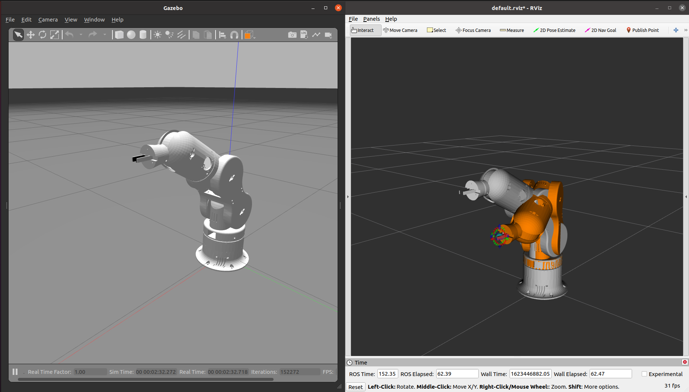

# thor_simulator
This repository contains the gazebo simulation and MoveIt packages for the [Thor robot arm](https://github.com/AngelLM/Thor) created by AngelLM. The physical parameters of the arm were estimated using SolidWorks and the [sw_urdf_exporter](http://wiki.ros.org/sw_urdf_exporter). A simple parallel gripper is included in the simulation. 

 

## Required packages
 - ROS Noetic (with Gazebo 11 included)
 - MoveIt
 - catkin_tools (recommended)

## Repository index
 
 - docs: Documentation images.
 - gripper_description: URDF, control and launch files for the parallel gripper.
 - thor_description: URDF, control and launch files for the thor arm.
 - thor_msgs: Messages defined for a control service for the gripper.
 - thor_standalone_moveit_config: MoveIt configuration for both the arm and gripper.
 - thor_test: Code for pose and manipulation tests.

## Running demo
 First, you must clone the packages to your catkin workspace and build them. To launch the arm in Gazebo and the MoveIt motion planning demo run the following line:

    roslaunch thor_description gazebo_moveit.launch 

